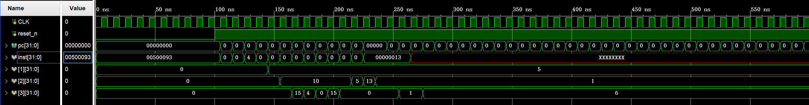

# RV32I 5级流水线CPU

## 设计功能

- 实现RISC-V RV32I基础整数指令集
- 5级流水线：IF → ID → EX → MEM → WB
- 数据冒险：Forwarding + Load-Use Stall
- 控制冒险：Flush
- 哈佛结构：指令存储器与数据存储器独立

## 设计思路

- 流水线寄存器：IF/ID、ID/EX、EX/MEM、MEM/WB，全部时序逻辑
- 前递单元：MEM→EX、WB→EX两级前递，MEM级优先
- 冒险检测：Load-Use自动stall一周期，插入bubble
- 寄存器堆：先写后读，异步读同步写，解决WB→ID数据传递
- 分支跳转：EX级判断，flush IF/ID和ID/EX

## 指令支持

R型：add、sub、and、or、slt

I型：addi、andi、ori、slti

访存：lw、sw

分支：beq、bne

跳转：jal、jalr

立即数：lui

## 流水线阶段

IF：取指，从imem读指令，PC更新

ID：译码，读寄存器堆，控制单元生成信号

EX：执行，ALU运算，计算分支跳转目标

MEM：访存，dmem读写

WB：写回，寄存器堆写入

## 关键机制

Forwarding：EX级需要数据时，从MEM级或WB级直接前递，不等待写回

Load-Use Stall：lw指令后紧跟需要该数据的指令，stall一周期

Branch Flush：branch/jump在EX级判断，flush已取的后续指令

## 验证方法

- 基础运算：add/addi/and/or等，验证ALU和寄存器堆
- 访存测试：lw/sw，验证dmem读写
- Forwarding：add后紧跟sub，EX级直接前递，无stall
- Load-Use Stall：lw后紧跟add，自动stall一周期
- 分支跳转：beq满足条件，flush后续指令，PC跳转

## 文件说明

pc.v：程序计数器，支持stall和跳转

imem.v：指令存储器，hex文件初始化

IF_ID.v：IF/ID流水线寄存器，stall/flush

decoder.v：指令译码，拆分字段和立即数

regfile.v：寄存器堆，先写后读

control.v：控制单元，生成ALU操作和控制信号

hazard_detection.v：冒险检测，Load-Use stall

ID_EX.v：ID/EX流水线寄存器，stall/flush

forwarding.v：前递单元，MEM/WB→EX

alu.v：算术逻辑单元，加减与或比较

EX_MEM.v：EX/MEM流水线寄存器

dmem.v：数据存储器，时序写组合读

MEM_WB.v：MEM/WB流水线寄存器，时序逻辑

top.v：顶层模块，连接所有阶段

top_tb.v：仿真测试平台

program.hex：测试程序，16条指令

## 仿真结果

## 综合结果

使用Yosys综合，SkyWater 130nm标准单元库

面积：1,287,027（归一化单位，存储器被综合为标准单元）

时序逻辑：24,824（1.93%，对应寄存器和流水线寄存器）

组合逻辑：98.07%（存储器阵列译码逻辑）

## 时序分析

使用Vivado完成FPGA综合，理解WNS/WHS/TNS/THS指标含义

ASIC时序分析因OpenSTA工具链依赖暂未深入，掌握setup/hold原理

## 后续计划

- 异常处理：ecall、ebreak、mret

- CSR寄存器：mstatus、mepc、mcause、mtvec

- 乘除法扩展：M扩展

- AXI4-Lite总线接口

## License

MIT License

## License

MIT License
